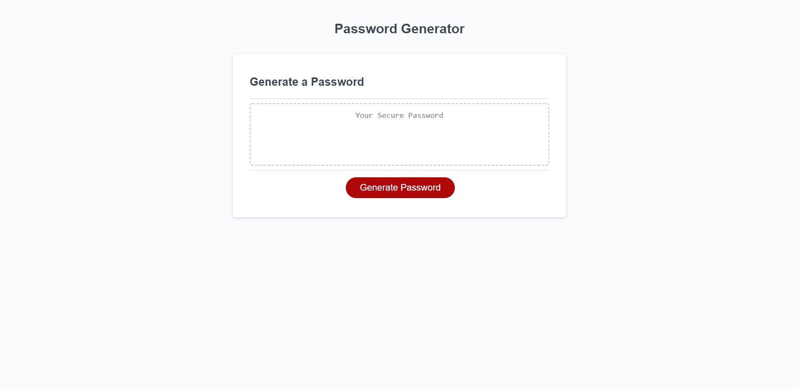
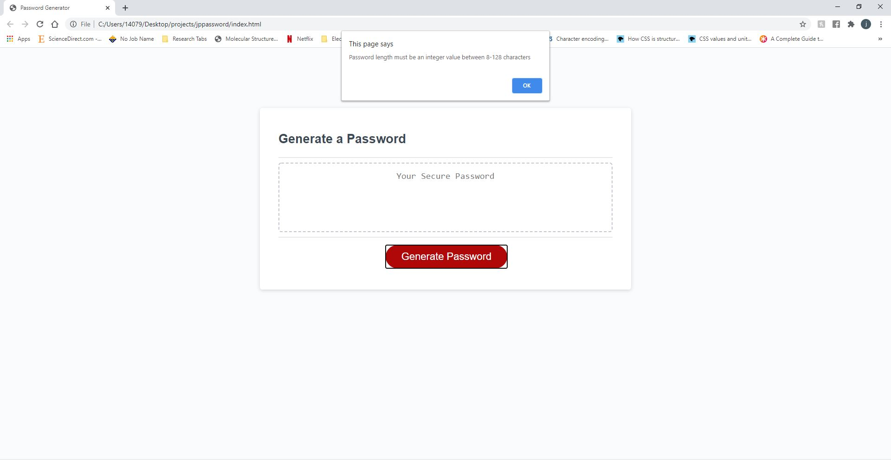
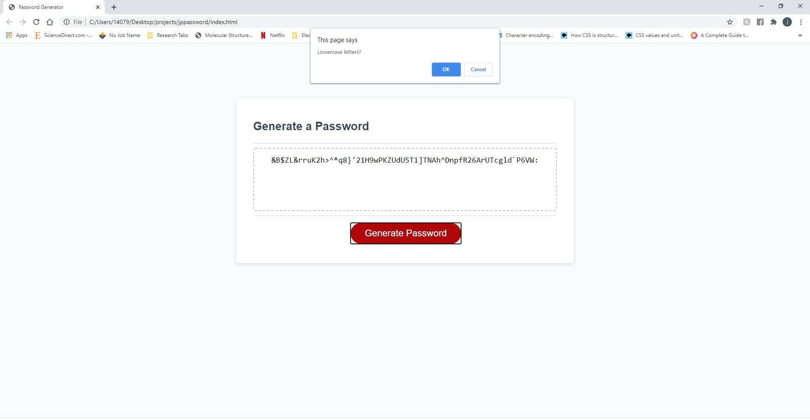
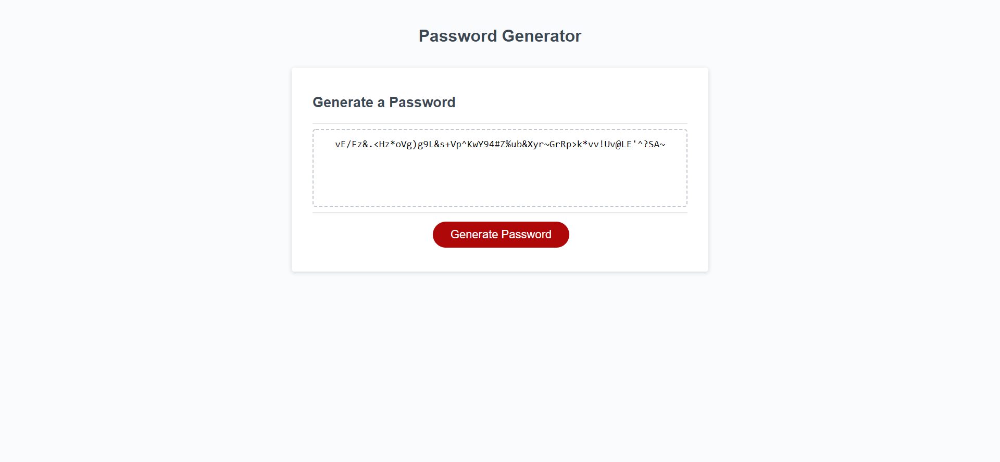

# JS-Random

The password generator is created using 

* If-Else statements
* For and While Loops 
* Strings and Arrays
* Logic Operators (+, - , * , ...)

## Example snapshots and Usage

The program begins with a simple generate onclick function linked directly to the JS files located in the assets folder.

The program will then access a series of window alerts which will specify the length of the password to be generated
and which chracter sets you wish to utilize such as 

* Upper and Lower Case Characters
* Numerical Values
* Special Characters

NOTE: THE PROMPTS WERE CONFIRMS TO PREVENT ANY EXTERNAL ACTIONS OCCURING WHEN PUTTING IN INPUT VIA BOOLEAN VALUES!!

The generated password will then be uploaded into the empty text box (Cannot be edited)

## Links to the project
You can find this linked at https://aznjp.github.io/JS-Random/